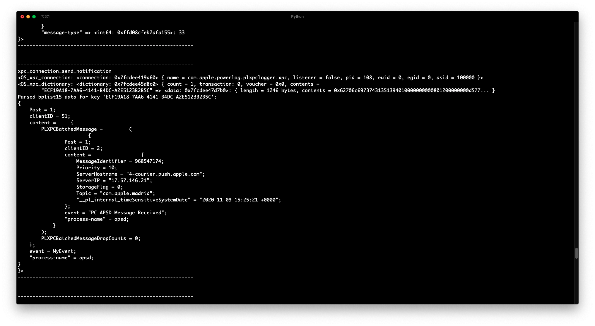

# xpcspy - Bidirectional XPC message interception and more

## Features:
* Bidirectional XPC message interception.
* iOS and macOS support.
* `bplist00`, and the infamous `bplist15` [deserialization].
* Filter by message direction (incoming or outgoing) and service name.
* More to come?


## Showcase
```
Usage: xpcspy [options] target

Options:
  --version             show program's version number and exit
  -h, --help            show this help message and exit
  -D ID, --device=ID    connect to device with the given ID
  -U, --usb             connect to USB device
  -R, --remote          connect to remote frida-server
  -H HOST, --host=HOST  connect to remote frida-server on HOST
  -f FILE, --file=FILE  spawn FILE
  -F, --attach-frontmost
                        attach to frontmost application
  -n NAME, --attach-name=NAME
                        attach to NAME
  -p PID, --attach-pid=PID
                        attach to PID
  --stdio=inherit|pipe  stdio behavior when spawning (defaults to “inherit”)
  --aux=option          set aux option when spawning, such as “uid=(int)42”
                        (supported types are: string, bool, int)
  --runtime=qjs|v8      script runtime to use
  --debug               enable the Node.js compatible script debugger
  --squelch-crash       if enabled, will not dump crash report to console
  -O FILE, --options-file=FILE
                        text file containing additional command line options
  -t FILTER, --filter=FILTER
                        Filter by message direction and service name. 'i'
                        denotes incoming and 'o' denotes outgoing. Service
                        name can include the wildcard character '*'. For
                        exmaple 'i:com.apple.*' or 'o:com.apple.apsd'.
  -r, --parse           Parse XPC dictionary keys that include either
                        `bplist00` or `bplist16` data.
  -o OUTPUT, --output=OUTPUT
                        dump output to file OUTPUT
```



## Installation
`pip3 install xpcspy`


## TODO:
* Add support for `bplist16`.
* Deserialize data within the parsed `bplist`s recursively.
* Improve script loading performance, kinda slow for some reason.
* Add an option to get the address, perhaps ASLR adjusted, for the XPC event handler, by spawning the process and hooking `xpc_connection_set_event_handler`.
* Add fancy colors.
* More pretty printing?


## FAQ 
* Why are you reinventing the [wheel]?
    * I'm not; XPoCe doesn't intercept incoming messages, and doesn't support `bplist00` or `bplist15`. 
    `

## License
[Apache License 2.0](LICENSE)

[wheel]: http://newosxbook.com/tools/XPoCe2.html
[deserialization]: http://newosxbook.com/bonus/bplist.pdf
